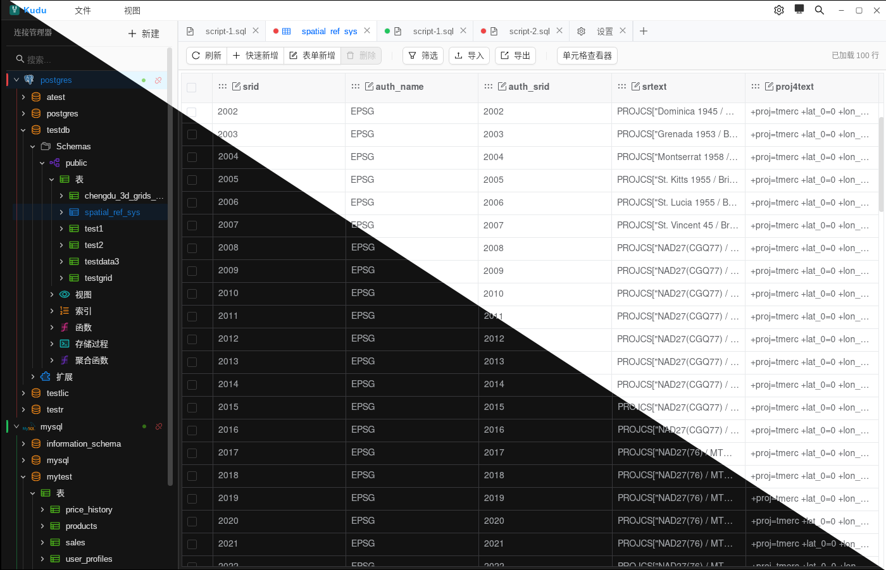

# Kudu

Kudu 是一个基于 Tauri 2、Vue 3 和 Rust 构建的轻量级桌面数据库客户端，面向日常查询、结构浏览和轻量数据维护场景。项目重点在于提供稳定、紧凑且一致的桌面数据库工作流体验。

----
# 社区支持 

学 AI , 上 L 站

[LinuxDO](https://linux.do/)

----

## 软件截图



## 产品定位

Kudu 主要解决以下几类桌面使用场景：

- 在多个数据库连接之间快速切换并保持工作区连续性
- 在 SQL 编辑、执行、取消、复制结果之间快速往返
- 对表数据进行查看、筛选、修改、预览和提交
- 以更轻量、紧凑的方式完成日常数据库操作

当前版本已围绕核心工作流完成一轮较系统的交互优化。不同数据库引擎的功能完整度仍有差异，但主要桌面体验已经形成稳定框架。

## 支持的数据库

- MySQL
- PostgreSQL
- SQLite
- MongoDB
- Redis

## 核心能力

### 连接与工作区

- 多连接管理与连接配置持久化
- 多标签工作区
- 会话恢复
- 数据库对象树浏览
- 连接级只读模式
- PostgreSQL `application_name` 标识

### SQL 编辑与执行

- 基于 Monaco Editor 的 SQL 编辑体验
- SQL 格式化
- 查询执行与取消
- 执行历史搜索
- SQL 片段管理
- 自动补全缓存刷新

### 结果与数据操作

- 多结果集展示
- 结果面板展开与收起
- 系统剪贴板统一复制
- 单元格查看器
- 表数据筛选、导入、导出
- 表数据新增、修改、删除预览与提交
- 行级 JSON / INSERT SQL 快速复制

### 结构与工具

- 表结构查看与设计器
- 查询构建器
- 数据对比工具

## 技术栈

- 前端：Vue 3、TypeScript、Pinia、Ant Design Vue、Monaco Editor、VXE Table
- 桌面端：Tauri 2
- 后端：Rust

## 项目状态

- 当前版本：`0.1.0`
- 当前重点：打磨核心工作流与桌面交互体验
- 测试现状：仓库中暂未提供完整自动化测试套件

建议在发布前至少完成以下验证：

```bash
npm run build
cargo check --manifest-path src-tauri/Cargo.toml
```

## 本地开发

### 环境要求

- Node.js 18+
- Rust stable
- Tauri 2 对应平台的构建环境

### 安装依赖

```bash
npm install
```

### 前端开发

```bash
npm run dev
```

### 桌面联调

```bash
npm run tauri:dev
```

### 生产构建

```bash
npm run build
npm run tauri:build
```

## 项目结构

```text
src/             Vue 前端
src-tauri/       Rust + Tauri 后端
public/          前端静态资源
docs/            发布说明与项目文档
```

## 上游项目与许可证

Kudu 基于上游项目 [Rabb1tQ/DataSmith](https://github.com/Rabb1tQ/DataSmith) 继续开发，并沿用 GPL-3.0 许可证要求进行分发。
